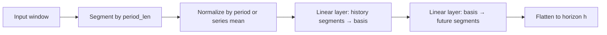
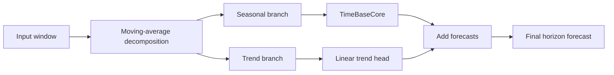

# TimeBaseUla

> Lightweight long-horizon forecasting models for NeuralForecast, built around the TimeBase paper and adapted to a CPU-first Python workflow.

**TL;DR**
- Install with `uv sync` for development or `pip install timebaseula` for usage.
- Main exports: `TimeBase`, `TimeBaseTrend`, `predict_single_series`.
- Works with [Nixtla NeuralForecast](https://nixtlaverse.nixtla.io/neuralforecast/).
- Includes benchmark and evaluation scripts for synthetic and long-horizon datasets.
- Documentation site: <https://dribia.github.io/timebaseula>

<p align="center">
  
</p>

## What this library is

TimeBaseUla is a small forecasting library that implements a **NeuralForecast-compatible** version of the **TimeBase** architecture:

- **TimeBase**: segment the input history into periods, learn a compact basis, forecast future segments, flatten back to the target horizon.
- **TimeBaseTrend**: decompose the series into trend + seasonal parts, forecast the seasonal component with TimeBase, and project the trend with a linear head.

The implementation is intentionally simple, readable, and CPU-friendly.

## Installation

### From PyPI

```bash
pip install timebaseula
```

### From source

```bash
git clone https://github.com/dribia/timebaseula.git
cd timebaseula
uv sync
```

## Quickstart

```python
import pandas as pd
from neuralforecast import NeuralForecast
from timebaseula import TimeBase

frame = pd.DataFrame(
    {
        "unique_id": "series_1",
        "ds": pd.date_range("2024-01-01", periods=200, freq="D"),
        "y": range(200),
    }
)

model = TimeBase(
    h=24,
    input_size=48,
    period_len=24,
    basis_num=6,
    max_steps=100,
    learning_rate=1e-3,
)

nf = NeuralForecast(models=[model], freq="D")
nf.fit(frame, val_size=24)
forecast = nf.predict()
print(forecast.head())
```

## Main API

| Object | Purpose |
|---|---|
| `TimeBase` | Basis-based segment forecaster |
| `TimeBaseTrend` | TimeBase with moving-average trend decomposition |
| `predict_single_series` | Helper for single-series inference after multi-series training |

## Model intuition



For `TimeBaseTrend`:



## Key hyperparameters

| Parameter | Meaning | Typical value |
|---|---|---|
| `h` | Forecast horizon | `24` |
| `input_size` | Historical context window | `48` or more |
| `period_len` | Segment length / natural period | `24` for daily hourly-style seasonality |
| `basis_num` | Basis rank | `6` |
| `use_period_norm` | Normalize each period separately | `True` |
| `use_orthogonal` | Add orthogonal basis regularization | `False` |
| `orthogonal_weight` | Strength of orthogonal penalty | `0.0+` |
| `moving_avg_window` | Trend smoother for `TimeBaseTrend` | odd, e.g. `25` |

## Repository contents

| Path | What it contains |
|---|---|
| `timebaseula/models/timebase.py` | Core model implementation |
| `timebaseula/utils.py` | Inference helper |
| `scripts/benchmark_long_horizon.py` | Benchmarks on ECL / TrafficL daily and monthly aggregates |
| `scripts/check_forecast_mae.py` | Synthetic MAE comparison table |
| `scripts/eval_dlinear_mae.py` | DLinear synthetic baseline |
| `scripts/generate_synthetic_plot.py` | Plot generation for docs |
| `tests/` | Unit and integration tests |
| `docs/` | MkDocs documentation |

## Development workflow

```bash
make format
make lint
make test
```

Integration tests are available with:

```bash
make test-integration
```

## Generate HTML documentation

Build the static docs site:

```bash
make docs
```

This writes the generated HTML to:

```text
site/
```

Serve the docs locally with live reload:

```bash
make docs-serve
```

Then open:

```text
http://127.0.0.1:8000
```

## Benchmarking notes

Long-horizon benchmarks use cached aggregates stored only under `datasets/`:

- `datasets/ecl_daily.parquet`
- `datasets/ecl_monthly.parquet`
- `datasets/trafficl_daily.parquet`
- `datasets/trafficl_monthly.parquet`

The benchmark CLI supports tuned modes:

- `--mode daily` → daily aggregate defaults (`horizon=14`, `max_steps=50`)
- `--mode monthly` → monthly aggregate defaults (`horizon=5`, `max_steps=30`)

Quick smoke test on CPU:

```bash
uv run --frozen python scripts/benchmark_long_horizon.py main \
  --mode daily \
  --n-series 5 \
  --horizon 7 \
  --max-steps 10 \
  --skip-arima \
  --output logs/benchmark_results_smoke.csv
```

Fast overnight run without ARIMA:

```bash
uv run --frozen python scripts/benchmark_long_horizon.py main \
  --mode daily \
  --skip-arima \
  --output logs/benchmark_results_full.csv
```

Full overnight run including both frequencies and ARIMA:

```bash
uv run --frozen python scripts/benchmark_long_horizon.py main \
  --mode all \
  --output logs/benchmark_results_full_with_arima.csv
```

By default, the benchmark tries to use a broad slice of the data: all available series up to `300`, and at least `200` when that many are present.

On this machine, an `ECL` daily smoke run with `5` series took about `10.7s` with `--skip-arima` and about `49.5s` with ARIMA enabled, so the new skip flag is useful for iterative work.

After producing a CSV, generate a markdown benchmark report with:

```bash
uv run --frozen python scripts/benchmark_long_horizon.py report \
  --input-csv logs/benchmark_results_smoke.csv \
  --output-md docs/benchmark.md
```

## Automatic default recommendation

The library now includes lightweight dataset profilers and recommenders for `TimeBase` and `TimeBaseTrend`.

You can call them directly:

```python
from timebaseula import recommend_timebase_kwargs, recommend_timebase_trend_kwargs

recommended_timebase = recommend_timebase_kwargs(
    frame=train_df,
    freq="D",
    horizon=28,
    max_steps=200,
)
recommended_timebase_trend = recommend_timebase_trend_kwargs(
    frame=train_df,
    freq="D",
    horizon=28,
    max_steps=200,
)
```

Or use the model classes directly:

```python
from timebaseula import TimeBase, TimeBaseTrend

profile = TimeBase.profile_dataset(train_df, freq="D", horizon=28)
defaults = TimeBase.recommend_defaults(train_df, freq="D", horizon=28, max_steps=200)
trend_defaults = TimeBaseTrend.recommend_defaults(
    train_df,
    freq="D",
    horizon=28,
    max_steps=200,
)
```

These helpers inspect the provided dataset quickly and recommend architecture and training defaults such as:

- `input_size`
- `period_len`
- `basis_num`
- `moving_avg_window`
- `max_steps`
- `learning_rate`
- `early_stop_patience_steps`
- `val_check_steps`

## Documentation notes

The documentation in this repository was refreshed by an AI coding agent after inspecting the codebase, scripts, tests, and existing docs.

## Paper reference

This project is based on the TimeBase paper included in the repository:

- Huang et al., **TimeBase** — see `docs/huang25az.pdf`

See the documentation site for a short paper summary, architecture notes, and references.

## License

MIT. See [LICENSE](LICENSE).
