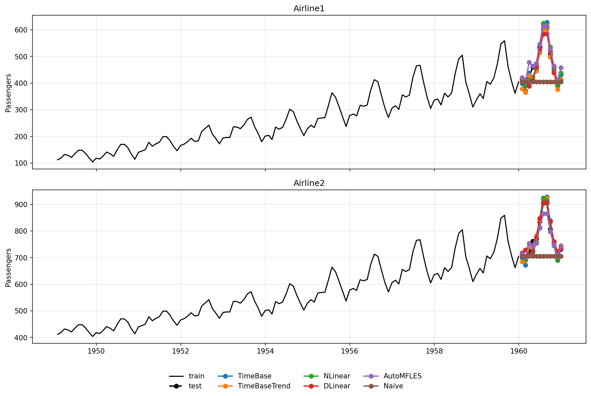
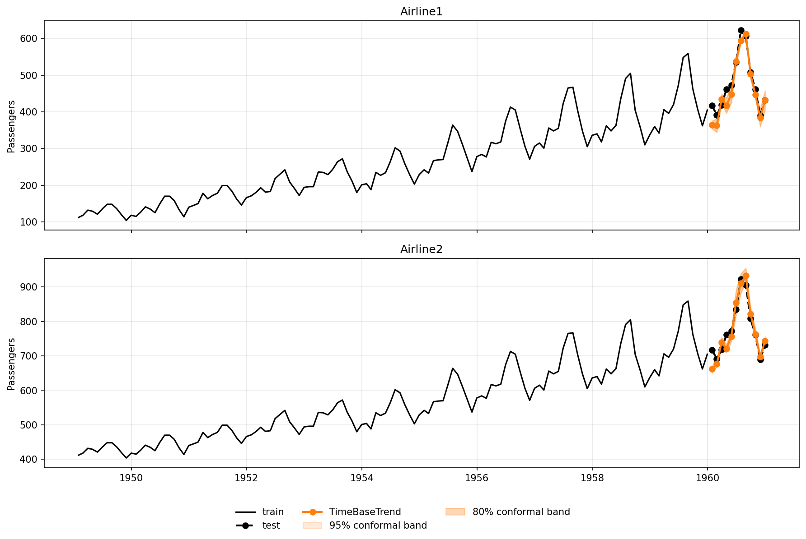

# AirPassengers benchmark

## TL;DR
- Dataset: `AirPassengersPanel` from `neuralforecast.utils`
- Horizon: `12` months per series
- Series benchmarked: `2`
- Models: `TimeBase`, `TimeBaseTrend`, `NLinear`, `DLinear`, `AutoMFLES`, `Naive`
- Best MAE in this run: `NLinear`

## Setup
- The benchmark uses the last `12` observations of each series as test data.
- Neural models use small model-specific settings tuned for this dataset.
- `RMAE` is computed relative to `Naive`.
- Statistical baselines report `0` trainable parameters.

!!! tip "Interpret these results with care"
    `AirPassengersPanel` is a difficult benchmark for neural networks because it contains only **two series** and a **short monthly history**.
    That means there is much less cross-series information and much less temporal evidence than in larger panel datasets.
    Neural models can still work well here, but this benchmark should be read as a **small-data stress test**, not as a broad ranking of neural forecasting performance.

## Metrics

| model | mae | rmse | rmae | parameters | runtime_seconds |
| --- | --- | --- | --- | --- | --- |
| NLinear | 12.3282 | 18.0104 | 0.1622 | 444 | 0.381 |
| TimeBase | 17.0719 | 19.5337 | 0.2246 | 37 | 0.1094 |
| TimeBaseTrend | 17.2453 | 20.5927 | 0.2269 | 656 | 0.4717 |
| AutoMFLES | 18.331 | 23.8342 | 0.2412 | 0 | 3.9106 |
| DLinear | 18.5919 | 23.2916 | 0.2446 | 312 | 0.2672 |
| Naive | 76.0 | 102.9765 | 1.0 | 0 | 0.0015 |

## Reproducible model settings

```python
MODEL_SETTINGS = {
  "TimeBase": {
    "input_size": 48,
    "max_steps": 30,
    "learning_rate": 0.01,
    "basis_num": 6,
    "period_len": 12
  },
  "TimeBaseTrend": {
    "input_size": 48,
    "max_steps": 100,
    "learning_rate": 0.01,
    "basis_num": 6,
    "period_len": 6,
    "moving_avg_window": 25
  },
  "NLinear": {
    "input_size": 36,
    "max_steps": 100,
    "learning_rate": 0.005
  },
  "DLinear": {
    "input_size": 12,
    "max_steps": 100,
    "learning_rate": 0.01
  },
  "AutoMFLES": {
    "test_size": 12,
    "season_length": 12
  },
  "Naive": {}
}
```

## Forecast plot



## TimeBaseTrend conformal intervals

The following example uses the same AirPassengers benchmark split and fits only
`TimeBaseTrend` with NeuralForecast's `PredictionIntervals` using the
`conformal_error` method.


