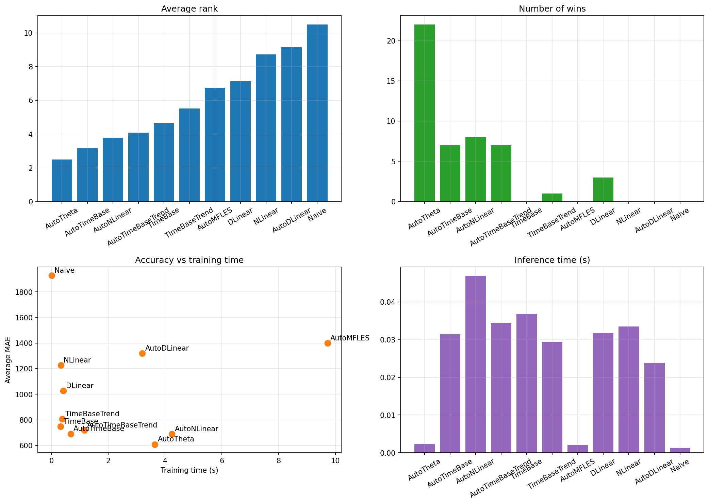
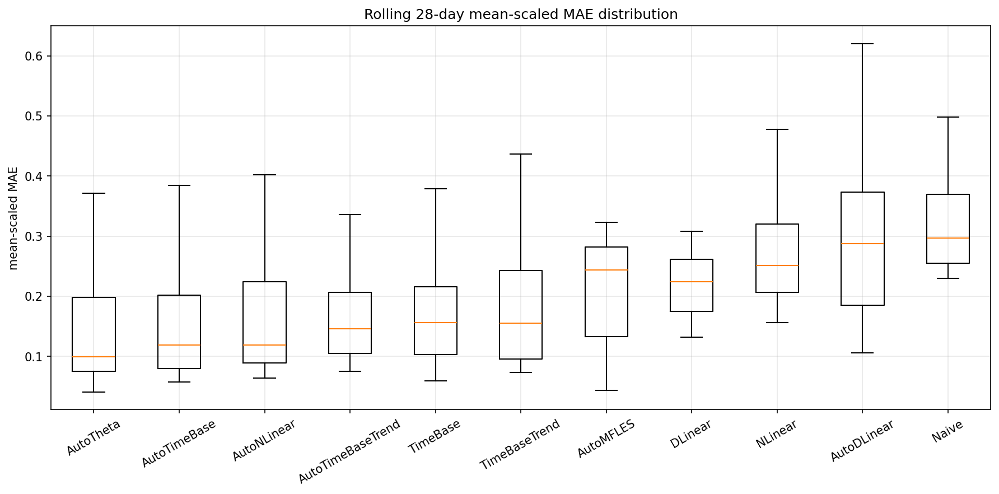
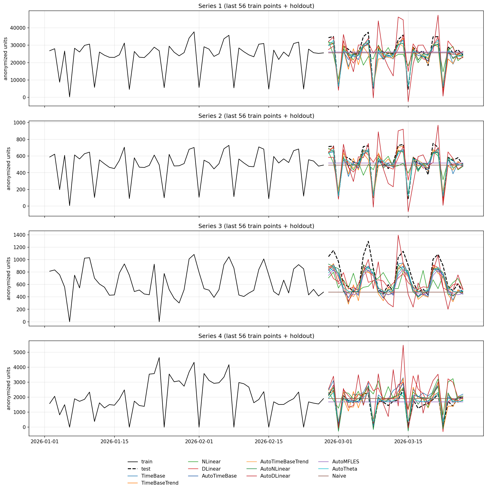

# Daily panel benchmark

## TL;DR
- Best model in this run: `AutoTheta`
- Benchmarked series: `8`
- Rolling evaluation windows: `6`
- Rolling test size: `168` days
- Forecast horizon: `28` daily steps

## Dataset summary
- Total regularized rows: `7504`
- Total unique dates: `938`
- Cross-validation train window: `2023-09-01 to 2025-10-09`
- Cross-validation test window: `2025-10-10 to 2026-03-26`
- Training profile: `smoke`
- Training and inference times are measured on the final single `28`-day holdout.
- Accuracy metrics are aggregated across rolling `28`-day cross-validation windows.

## Aggregate metrics

| metric | AutoTheta | AutoTimeBase | AutoNLinear | AutoTimeBaseTrend | TimeBase | TimeBaseTrend | AutoMFLES | DLinear | NLinear | AutoDLinear | Naive |
| --- | --- | --- | --- | --- | --- | --- | --- | --- | --- | --- | --- |
| training_time_seconds | 3.6427 | 0.6715 | 4.2407 | 1.1545 | 0.3202 | 0.3807 | 9.7198 | 0.411 | 0.3308 | 3.1984 | 0.0014 |
| inference_time_seconds | 0.0023 | 0.0314 | 0.0469 | 0.0344 | 0.0368 | 0.0293 | 0.0021 | 0.0318 | 0.0335 | 0.0238 | 0.0013 |
| parameters | 0 | 106 | 1596 | 3294 | 82 | 2486 | 0 | 3192 | 1596 | 3192 | 0 |
| avg_mae | 609.0243 | 691.2606 | 690.8402 | 719.9906 | 749.4134 | 806.8331 | 1400.1926 | 1027.942 | 1227.5166 | 1319.8772 | 1928.912 |
| median_mae | 88.5576 | 98.5836 | 106.5252 | 107.7234 | 118.6686 | 114.977 | 159.4674 | 152.475 | 198.0764 | 210.3267 | 223.4562 |
| avg_mean_scaled_mae | 0.146 | 0.1503 | 0.1599 | 0.16 | 0.1666 | 0.1744 | 0.2841 | 0.2328 | 0.269 | 0.2961 | 0.4127 |
| median_mean_scaled_mae | 0.0996 | 0.119 | 0.1193 | 0.1464 | 0.1563 | 0.1552 | 0.2437 | 0.2244 | 0.251 | 0.2874 | 0.2967 |
| avg_rmse | 852.0482 | 963.3085 | 970.1477 | 1013.8175 | 1036.2786 | 1125.7778 | 1795.6258 | 1379.4565 | 1618.9839 | 1663.2039 | 2467.2107 |
| median_rmse | 140.2802 | 148.4712 | 161.5442 | 160.3489 | 163.9936 | 160.3506 | 230.0993 | 212.7486 | 252.3119 | 272.3673 | 331.6487 |
| avg_smape | 0.1009 | 0.1051 | 0.1118 | 0.1108 | 0.1152 | 0.1193 | 0.1964 | 0.1501 | 0.1761 | 0.2051 | 0.3067 |
| median_smape | 0.0618 | 0.0651 | 0.0783 | 0.0824 | 0.0889 | 0.0876 | 0.1569 | 0.1348 | 0.1523 | 0.1904 | 0.1761 |
| avg_rank | 2.5 | 3.1667 | 3.7917 | 4.0833 | 4.6458 | 5.5208 | 6.75 | 7.1667 | 8.7292 | 9.1458 | 10.5 |
| median_rank | 2 | 3 | 4 | 4 | 5 | 5 | 7 | 7 | 9 | 9 | 11 |
| wins | 22 | 7 | 8 | 7 | 0 | 1 | 0 | 3 | 0 | 0 | 0 |

## Reproducible model settings

```python
MODEL_SETTINGS = {
  "TimeBase": {
    "input_size": 56,
    "max_steps": 32,
    "learning_rate": 0.001,
    "basis_num": 6,
    "period_len": 7
  },
  "TimeBaseTrend": {
    "input_size": 84,
    "max_steps": 40,
    "learning_rate": 0.001,
    "basis_num": 6,
    "period_len": 7,
    "moving_avg_window": 21
  },
  "NLinear": {
    "input_size": 56,
    "max_steps": 40,
    "learning_rate": 0.002
  },
  "DLinear": {
    "input_size": 56,
    "max_steps": 40,
    "learning_rate": 0.002
  },
  "AutoMFLES": {
    "season_length": 7
  },
  "Naive": {},
  "AutoTheta": {
    "season_length": 7
  },
  "AutoTimeBase": {
    "input_size": 84,
    "basis_num": 6,
    "period_len": 7,
    "learning_rate": 0.001,
    "max_steps": 100
  },
  "AutoTimeBaseTrend": {
    "input_size": 112,
    "basis_num": 6,
    "period_len": 7,
    "moving_avg_window": 29,
    "learning_rate": 0.001,
    "max_steps": 120
  },
  "AutoDLinear": {
    "input_size": 56,
    "learning_rate": 0.07102170416433433,
    "max_steps": 600,
    "step_size": 28,
    "scaler_type": "robust",
    "moving_avg_window": 25
  },
  "AutoNLinear": {
    "input_size": 56,
    "learning_rate": 0.0034313488579691643,
    "max_steps": 600,
    "step_size": 1,
    "scaler_type": "standard"
  }
}
```

## Comments
- Best overall trade-off in this run: AutoTheta (average rank 2.5, wins 22).
- Best average mean-scaled MAE across rolling 28-day windows: AutoTheta (0.146).

## Plots






