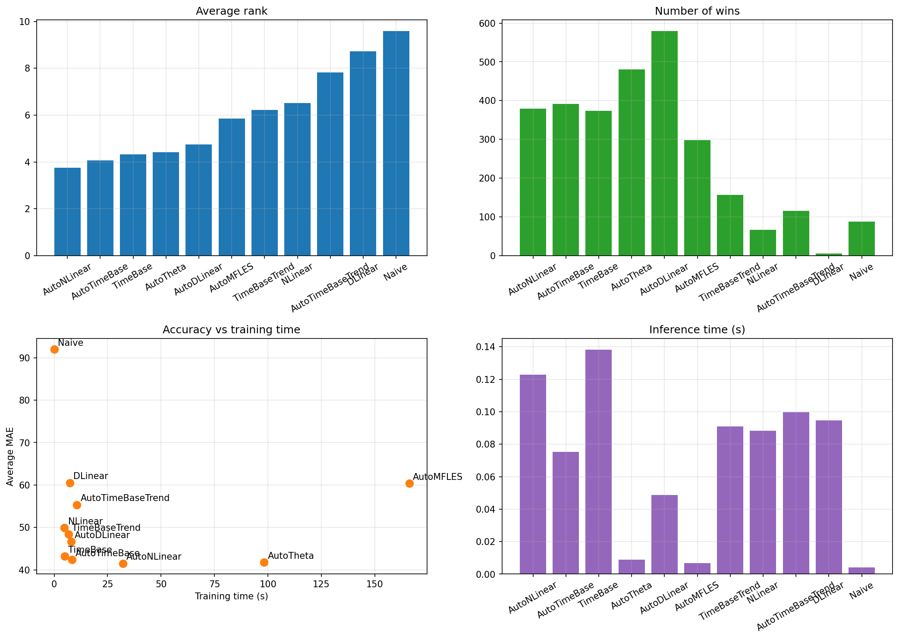
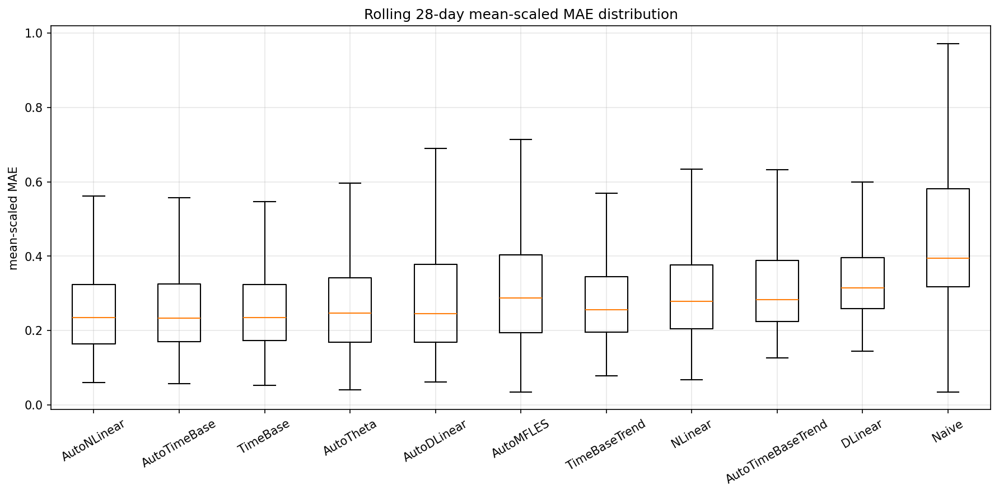
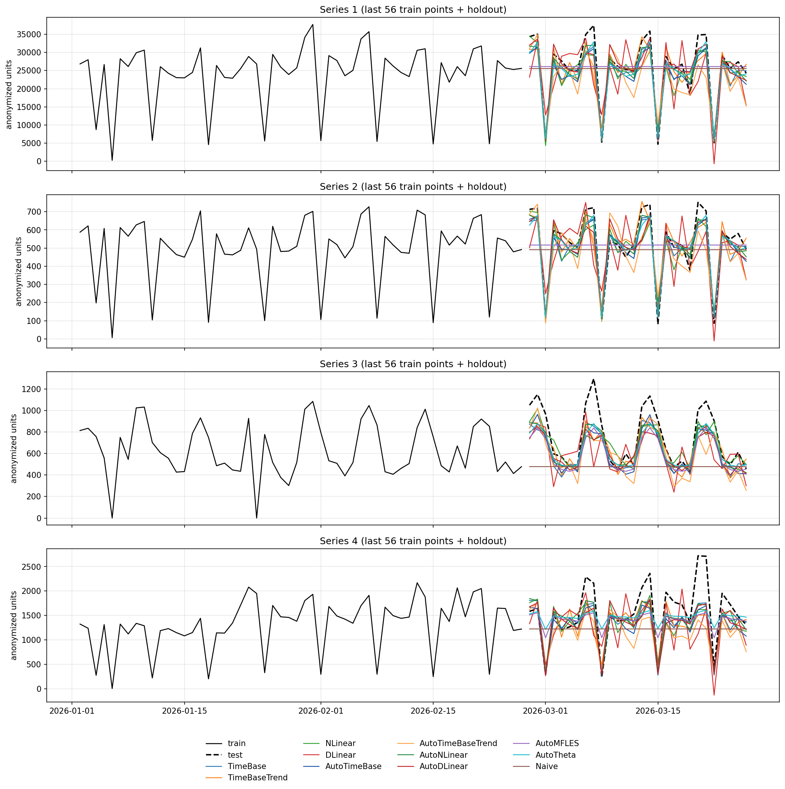

# Aggregated daily-panel benchmark

## TL;DR
- Scope: aggregated series only
- Included series: higher-level aggregates and global `total`
- Excluded series: the most granular combinations
- Best overall model in this published run: `AutoNLinear`
- Strongest statistical baseline in this published run: `AutoTheta`
- Benchmarked series: `504`
- Rolling evaluation windows: `6`
- Rolling test size: `168` days
- Forecast horizon: `28` daily steps
- Training profile: `heavy`

## Dataset summary
- Total regularized rows: `472752`
- Total unique dates: `938`
- Aggregated candidate series after filtering: `504`
- Cross-validation train window: `2023-09-01 to 2025-10-09`
- Cross-validation test window: `2025-10-10 to 2026-03-26`
- Training and inference times are measured on the final single `28`-day holdout.
- Accuracy metrics are aggregated across rolling `28`-day cross-validation windows.
- Published plots use anonymized series aliases and anonymized units.

## Benchmark machine
- OS: `Ubuntu 24.04` on Linux kernel `6.17.0-19-generic`
- CPU: `Intel(R) Core(TM) Ultra 5 125U`
- Logical CPUs: `14`
- Available memory: about `15 GiB RAM`
- GPU usage: none, CPU-only benchmark runs

## Tuning setup
- `AutoDLinear` and `AutoNLinear` were tuned with NeuralForecast native auto models.
- `AutoTimeBase` and `AutoTimeBaseTrend` were tuned with a compact repo-local search over practical CPU-first hyperparameter grids.
- The tuned configs were selected on aggregated holdout validation and then benchmarked on the same published rolling evaluation used for the other models.

Best tuned configs:

```json
{
  "AutoTimeBase": {
    "input_size": 112,
    "basis_num": 10,
    "period_len": 14,
    "learning_rate": 0.0007,
    "max_steps": 240
  },
  "AutoTimeBaseTrend": {
    "input_size": 168,
    "basis_num": 8,
    "period_len": 14,
    "moving_avg_window": 35,
    "learning_rate": 0.0005,
    "max_steps": 260
  },
  "AutoDLinear": {
    "input_size": 84,
    "learning_rate": 0.0009754278461230969,
    "max_steps": 1300,
    "step_size": 28,
    "scaler_type": "robust",
    "moving_avg_window": 51
  },
  "AutoNLinear": {
    "input_size": 84,
    "learning_rate": 0.002293473193770154,
    "max_steps": 900,
    "step_size": 1,
    "scaler_type": "standard"
  }
}
```

## Aggregate metrics

| metric | AutoNLinear | AutoTimeBase | TimeBase | AutoTheta | AutoDLinear | AutoMFLES | TimeBaseTrend | NLinear | AutoTimeBaseTrend | DLinear | Naive |
| --- | --- | --- | --- | --- | --- | --- | --- | --- | --- | --- | --- |
| training_time_seconds | 32.1481 | 8.2687 | 4.9063 | 98.2117 | 7.8584 | 166.0776 | 6.7287 | 4.7668 | 10.6683 | 7.3367 | 0.0244 |
| inference_time_seconds | 0.1228 | 0.0753 | 0.1382 | 0.0089 | 0.0486 | 0.0068 | 0.091 | 0.0884 | 0.0997 | 0.0947 | 0.004 |
| parameters | 2380 | 112 | 82 | 0 | 4760 | 0 | 2486 | 1596 | 4854 | 3192 | 0 |
| cv_refit | no | no | no | no | no | yes | no | no | no | no | no |
| avg_mae | 41.5181 | 42.3617 | 43.1715 | 41.7856 | 46.6169 | 60.4108 | 48.4158 | 49.9234 | 55.3387 | 60.518 | 92.0034 |
| median_mae | 21.2206 | 22.0057 | 22.0292 | 22.1467 | 22.6462 | 25.1254 | 24.6585 | 25.5636 | 28.8428 | 30.7844 | 39.6607 |
| avg_mean_scaled_mae | 0.2796 | 0.2955 | 0.296 | 0.4854 | 0.3007 | 0.3362 | 0.3326 | 0.328 | 0.3659 | 0.3783 | 0.5078 |
| median_mean_scaled_mae | 0.2345 | 0.2336 | 0.2347 | 0.2473 | 0.2448 | 0.2881 | 0.2559 | 0.2786 | 0.2829 | 0.3155 | 0.3949 |
| avg_rmse | 56.2791 | 58.2753 | 59.2198 | 55.7916 | 60.8267 | 77.3992 | 65.0777 | 64.9936 | 70.8848 | 78.1803 | 116.5788 |
| median_rmse | 28.5364 | 29.9112 | 30.2177 | 29.1839 | 30.1571 | 33.3829 | 33.243 | 33.1824 | 36.7617 | 39.5583 | 52.3481 |
| avg_smape | 0.2354 | 0.2393 | 0.2384 | 0.2155 | 0.2473 | 0.2372 | 0.2525 | 0.2612 | 0.2694 | 0.2796 | 0.3376 |
| median_smape | 0.2025 | 0.2034 | 0.205 | 0.2037 | 0.2106 | 0.2089 | 0.217 | 0.2295 | 0.2253 | 0.2422 | 0.2355 |
| avg_rank | 3.748 | 4.0737 | 4.3198 | 4.4142 | 4.7384 | 5.8525 | 6.2113 | 6.5116 | 7.8304 | 8.7163 | 9.5838 |
| median_rank | 4 | 4 | 4 | 4 | 4 | 6 | 6 | 7 | 9 | 9 | 11 |
| wins | 379 | 391 | 374 | 480 | 579 | 298 | 156 | 66 | 115 | 5 | 88 |

## Interpretation
- `AutoNLinear` is the strongest overall model in this published aggregated run. It leads on `avg_rank`, `avg_mae`, `median_mae`, and `avg_mean_scaled_mae`, so the tuning pass materially improved the NLinear family.
- `AutoTimeBase` is a small improvement over the untuned `TimeBase`, but the gain is modest rather than transformative on this panel.
- `AutoTimeBaseTrend` does not beat the untuned `TimeBaseTrend` here, which suggests that the current trend-branch search space is not yet the main leverage point for this aggregated task.
- `AutoDLinear` becomes much more competitive after tuning and achieves the highest raw `wins`, but it still does not beat `AutoNLinear` on the broader accuracy summary.
- `AutoTheta` remains the strongest classical baseline. It still offers the best `avg_rmse` and `avg_smape`, and it remains a very credible non-neural benchmark.
- `AutoMFLES` remains slow and is the only model in this table that falls back to `refit=True` during cross-validation, so its results should be compared with that caveat in mind.

## Recommendation
- Choose `AutoNLinear` as the default model for aggregated daily forecasting if you want the best tuned neural result from this benchmark.
- Keep `AutoTheta` as the main non-neural reference when raw scale-sensitive error and statistical simplicity matter.
- Keep `AutoTimeBase` as a competitive alternative when you prefer the explicit TimeBase family, but on this published run it does not beat `AutoNLinear`.
- Treat `AutoMFLES` carefully because its daily cross-validation path refits while the other models in this table do not.

## Plots






