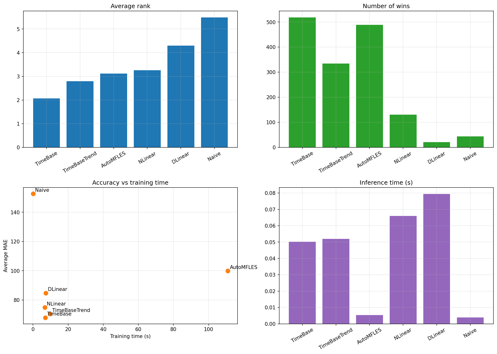
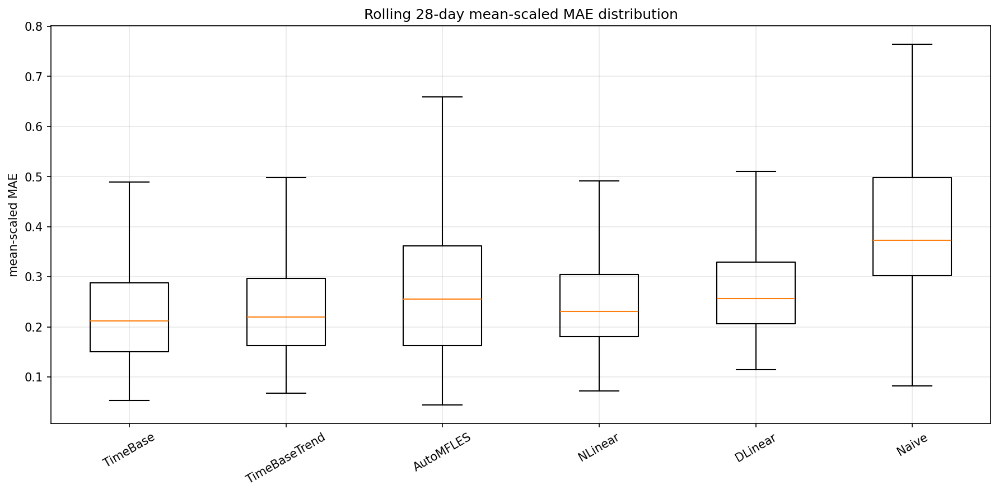
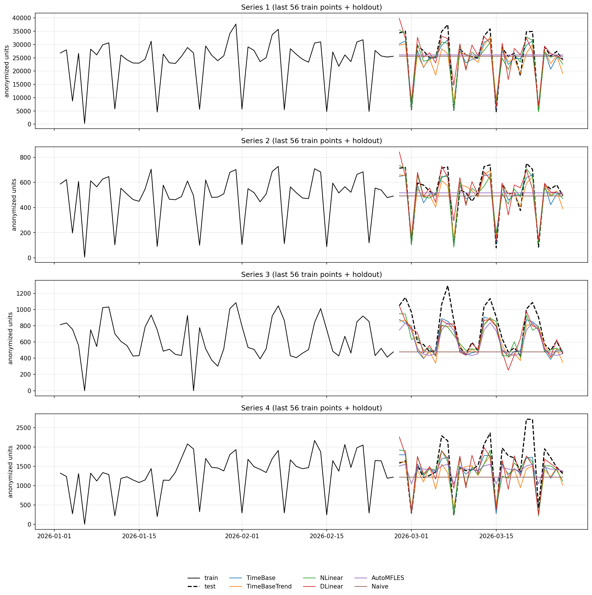

# Daily panel benchmark

## TL;DR
- Best model in this run: `TimeBase`
- Benchmarked series: `256`
- Rolling evaluation windows: `6`
- Rolling test size: `168` days
- Forecast horizon: `28` daily steps

## Dataset summary
- Total regularized rows: `240128`
- Total unique dates: `938`
- Cross-validation train window: `2023-09-01 to 2025-10-09`
- Cross-validation test window: `2025-10-10 to 2026-03-26`
- Training profile: `heavy`
- Training and inference times are measured on the final single `28`-day holdout.
- Accuracy metrics are aggregated across rolling `28`-day cross-validation windows.
- Published plots use anonymized series aliases and anonymized units.

## Benchmark machine
- OS: `Ubuntu 24.04` on Linux kernel `6.17.0-19-generic`
- CPU: `Intel(R) Core(TM) Ultra 5 125U`
- Logical CPUs: `14`
- Available memory: about `15 GiB RAM`
- GPU usage: none, CPU-only benchmark runs

## Aggregate metrics

| metric | TimeBase | TimeBaseTrend | AutoMFLES | NLinear | DLinear | Naive |
| --- | --- | --- | --- | --- | --- | --- |
| training_time_seconds | 6.9537 | 9.7899 | 110.9958 | 6.7268 | 7.3407 | 0.0195 |
| inference_time_seconds | 0.0502 | 0.052 | 0.0054 | 0.066 | 0.0794 | 0.0039 |
| parameters | 82 | 2486 | 0 | 1596 | 3192 | 0 |
| avg_mae | 67.9572 | 70.4985 | 99.9432 | 74.9211 | 84.7788 | 152.6325 |
| median_mae | 35.7026 | 38.2092 | 42.1879 | 39.3079 | 44.9805 | 70.125 |
| avg_mean_scaled_mae | 0.2383 | 0.2535 | 0.3015 | 0.2608 | 0.2885 | 0.4726 |
| median_mean_scaled_mae | 0.2123 | 0.2195 | 0.2559 | 0.2307 | 0.2564 | 0.373 |
| avg_rmse | 94.384 | 96.821 | 128.3349 | 99.9352 | 109.4186 | 194.0556 |
| median_rmse | 49.1716 | 51.4755 | 56.1837 | 52.3747 | 57.1701 | 93.8925 |
| avg_smape | 0.187 | 0.1908 | 0.2233 | 0.2007 | 0.2154 | 0.3329 |
| median_smape | 0.1855 | 0.1847 | 0.1968 | 0.1971 | 0.2095 | 0.2272 |
| avg_rank | 2.0625 | 2.7884 | 3.1133 | 3.2533 | 4.2995 | 5.4831 |
| median_rank | 2 | 3 | 3 | 3 | 4 | 6 |
| wins | 518 | 334 | 489 | 130 | 21 | 44 |

## Reproducible model settings

```python
MODEL_SETTINGS = {
  "TimeBase": {
    "input_size": 56,
    "max_steps": 256,
    "learning_rate": 0.001,
    "basis_num": 6,
    "period_len": 7
  },
  "TimeBaseTrend": {
    "input_size": 84,
    "max_steps": 304,
    "learning_rate": 0.001,
    "basis_num": 6,
    "period_len": 7,
    "moving_avg_window": 21
  },
  "NLinear": {
    "input_size": 56,
    "max_steps": 240,
    "learning_rate": 0.002
  },
  "DLinear": {
    "input_size": 56,
    "max_steps": 240,
    "learning_rate": 0.002
  },
  "AutoMFLES": {
    "season_length": 7
  },
  "Naive": {}
}
```

## Comments
- Best overall trade-off in this run: TimeBase (average rank 2.0625, wins 518).
- Best average mean-scaled MAE across rolling 28-day windows: TimeBase (0.2383).

## Plots






