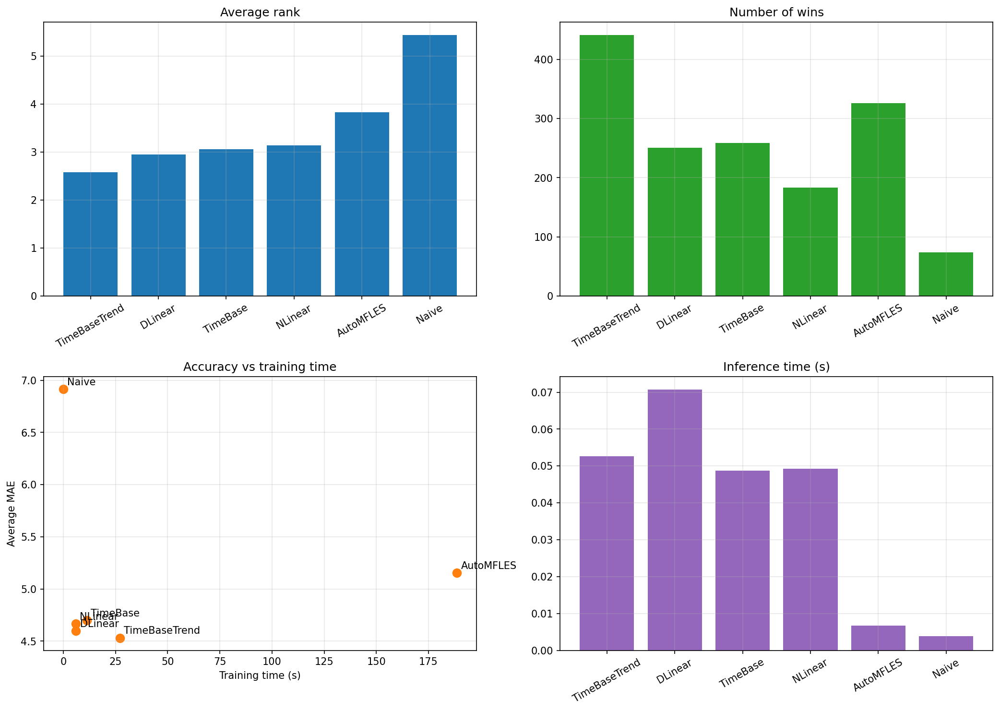
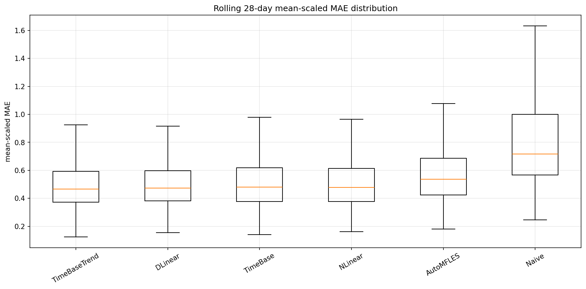
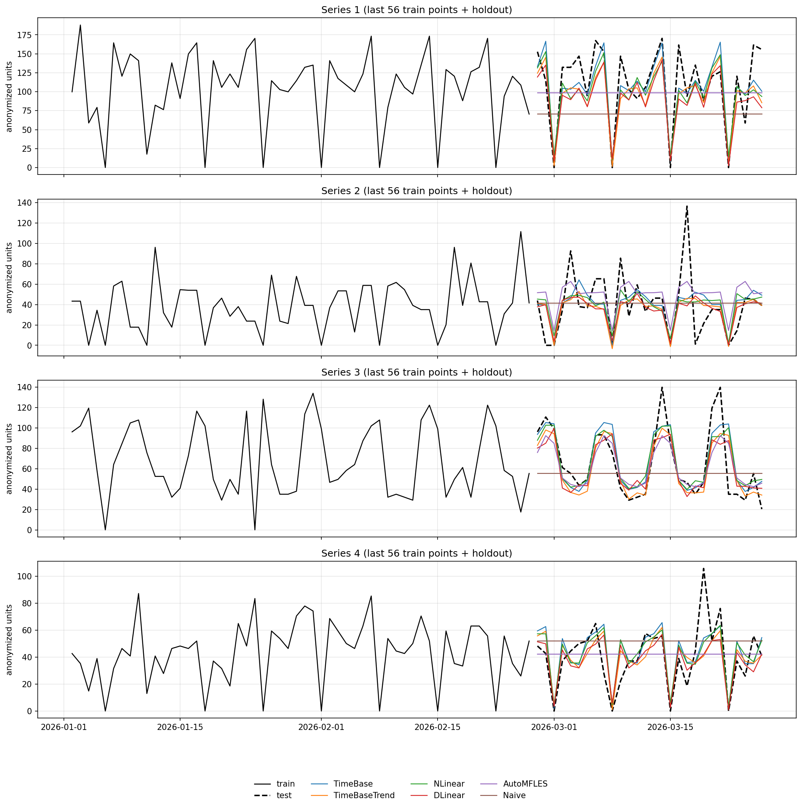

# Detailed daily-panel benchmark

## TL;DR
- Benchmark type: internal anonymized benchmark
- Scope: detailed series only
- Published run excludes: `AutoTheta`
- Best overall model in this published rerun: `TimeBaseTrend`
- Best mean-scaled MAE in this published rerun: `DLinear`
- Benchmarked series: `256`
- Rolling evaluation windows: `6`
- Forecast horizon: `28` daily steps
- Training profile: `heavy`

## Dataset summary
- Total regularized rows: `240128`
- Total unique dates: `938`
- Eligible detailed candidate series after filtering: `42616`
- Cross-validation train window: `2023-09-01 to 2025-10-09`
- Cross-validation test window: `2025-10-10 to 2026-03-26`
- Training and inference times are measured on the final single `28`-day holdout.
- Accuracy metrics are aggregated across rolling `28`-day cross-validation windows.
- Published plots use anonymized series aliases and anonymized units.

## Benchmark machine
- OS: `Ubuntu 24.04` on Linux kernel `6.17.0-19-generic`
- CPU: `Intel(R) Core(TM) Ultra 5 125U`
- Logical CPUs: `14`
- Available memory: about `15 GiB RAM`
- GPU usage: none, CPU-only benchmark runs

## Aggregate metrics

| metric | TimeBaseTrend | DLinear | TimeBase | NLinear | AutoMFLES | Naive |
| --- | --- | --- | --- | --- | --- | --- |
| training_time_seconds | 27.0663 | 6.0209 | 11.1738 | 5.872 | 188.5954 | 0.0211 |
| inference_time_seconds | 0.0527 | 0.0707 | 0.0487 | 0.0492 | 0.0067 | 0.0038 |
| parameters | 2486 | 3192 | 82 | 1596 | 0 | 0 |
| avg_mae | 4.5316 | 4.5996 | 4.7008 | 4.6677 | 5.1535 | 6.9157 |
| median_mae | 3.706 | 3.7087 | 3.7978 | 3.7838 | 4.0343 | 5.6429 |
| avg_mean_scaled_mae | 0.5918 | 0.5855 | 0.6159 | 0.6021 | 0.604 | 0.7719 |
| median_mean_scaled_mae | 0.4661 | 0.4734 | 0.4794 | 0.4784 | 0.5367 | 0.716 |
| avg_rmse | 6.3119 | 6.3834 | 6.5088 | 6.4238 | 6.8168 | 8.9014 |
| median_rmse | 4.8417 | 4.8375 | 4.9469 | 4.8721 | 5.1775 | 7.0812 |
| avg_smape | 0.3668 | 0.3679 | 0.3683 | 0.3676 | 0.3772 | 0.4785 |
| median_smape | 0.3471 | 0.3519 | 0.35 | 0.3476 | 0.3578 | 0.4178 |
| avg_rank | 2.5814 | 2.946 | 3.0599 | 3.1419 | 3.834 | 5.4368 |
| median_rank | 2 | 3 | 3 | 3 | 5 | 6 |
| wins | 441 | 251 | 259 | 183 | 326 | 74 |

## Interpretation
- `TimeBaseTrend` remains the strongest overall model in this detailed-only run.
- `DLinear` still has the best `avg_mean_scaled_mae`, so it remains the best choice when normalized error is the main objective.
- `TimeBase` stays competitive, but the added trend branch helps the TimeBase family most on detailed series.
- `AutoMFLES` remains useful as a statistical baseline, but it is far slower to train.

## Recommendation
- Choose `TimeBaseTrend` as the default model for this detailed-only benchmark when you want the strongest overall trade-off.
- Choose `DLinear` when mean-scaled error is the primary decision metric.
- Keep `TimeBase` and `NLinear` as strong secondary neural baselines.

## Supplementary Poisson-loss rerun for neural-only models

A follow-up heavy rerun was executed on the same detailed subset using `--neural-loss poisson` and only the NeuralForecast variants.
It is a probabilistic-loss comparison, not a replacement for the published headline table above.

### Poisson rerun summary

| metric | TimeBaseTrend | TimeBase | DLinear | NLinear |
| --- | --- | --- | --- | --- |
| training_time_seconds | 22.7206 | 17.5791 | 17.5703 | 18.2361 |
| inference_time_seconds | 1.1394 | 1.1722 | 0.8513 | 1.029 |
| parameters | 2486 | 82 | 3192 | 1596 |
| avg_mae | 4.6205 | 4.7719 | 4.8449 | 4.9541 |
| median_mae | 3.7356 | 3.8686 | 3.8667 | 4.0292 |
| avg_mean_scaled_mae | 0.63 | 0.6427 | 0.645 | 0.6525 |
| median_mean_scaled_mae | 0.4701 | 0.483 | 0.4918 | 0.5055 |
| avg_rmse | 6.3884 | 6.5296 | 6.581 | 6.6686 |
| median_rmse | 4.8184 | 4.963 | 4.9255 | 5.0782 |
| avg_smape | 0.3601 | 0.3619 | 0.3641 | 0.3661 |
| median_smape | 0.342 | 0.3447 | 0.3461 | 0.3479 |
| avg_rank | 1.9056 | 2.3483 | 2.6576 | 3.0885 |
| median_rank | 1 | 2 | 3 | 3 |
| wins | 769 | 351 | 237 | 179 |

### Comparison against the published detailed benchmark

| model | published avg_mae | Poisson rerun avg_mae | delta | published avg_mean_scaled_mae | Poisson avg_mean_scaled_mae | delta |
| --- | --- | --- | --- | --- | --- | --- |
| TimeBaseTrend | 4.5316 | 4.6205 | +0.0889 | 0.5918 | 0.63 | +0.0382 |
| TimeBase | 4.7008 | 4.7719 | +0.0711 | 0.6159 | 0.6427 | +0.0268 |
| DLinear | 4.5996 | 4.8449 | +0.2453 | 0.5855 | 0.645 | +0.0595 |
| NLinear | 4.6677 | 4.9541 | +0.2864 | 0.6021 | 0.6525 | +0.0504 |

### Analysis of the Poisson rerun
- `TimeBaseTrend` remains the strongest neural model under Poisson loss.
- The Poisson rerun does not improve the top detailed models relative to the published benchmark table.
- The degradation is modest for the TimeBase family and larger for `DLinear` and `NLinear`.
- The published plots above therefore remain tied to the stronger current headline configuration.

## Reproducible model settings

```python
MODEL_SETTINGS = {
  "TimeBase": {"input_size": 56, "max_steps": 256, "learning_rate": 0.001, "basis_num": 6, "period_len": 7},
  "TimeBaseTrend": {
    "input_size": 84,
    "max_steps": 304,
    "learning_rate": 0.001,
    "basis_num": 6,
    "period_len": 7,
    "moving_avg_window": 21
  },
  "NLinear": {"input_size": 56, "max_steps": 240, "learning_rate": 0.002},
  "DLinear": {"input_size": 56, "max_steps": 240, "learning_rate": 0.002},
  "AutoMFLES": {"season_length": 7},
  "Naive": {}
}
```

## Plots






