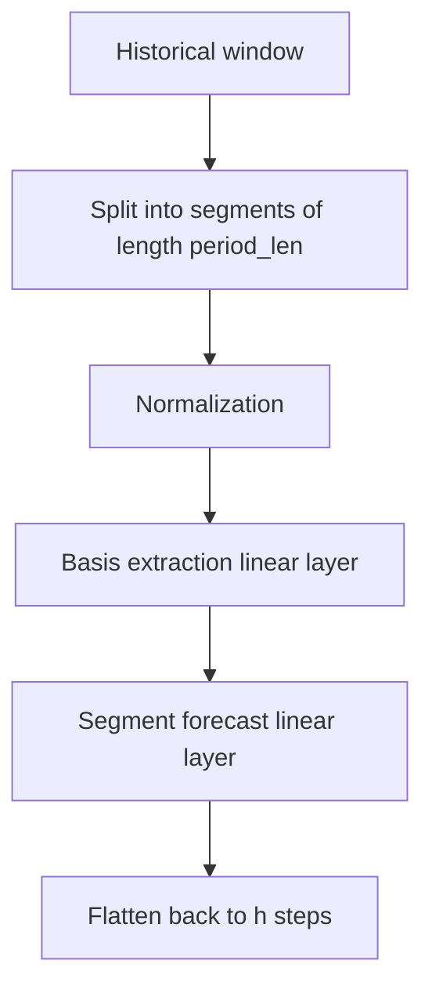
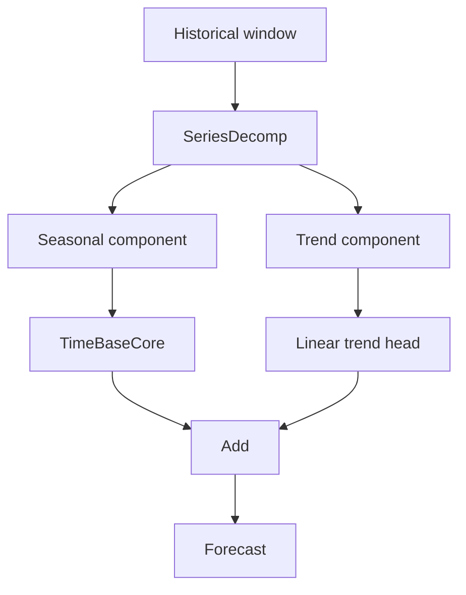

# TimeBaseUla

**TL;DR**
- `timebaseula` provides `TimeBase`, `TimeBaseTrend`, and `make_synthetic_series`.
- The models plug into **NeuralForecast**.
- Multi-series training plus single-series prediction is handled directly by NeuralForecast.
- Start with [install](install.md), then [usage](usage.md), [models](models.md), and [paper-for-agents](paper-for-agents.md).

<p align="center">
  
</p>

## Why this project exists

TimeBaseUla is a Python adaptation of the **TimeBase** forecasting idea with a repository style that emphasizes:

- CPU-first execution
- small PyTorch modules
- compatibility with Nixtla's `NeuralForecast`
- fast unit tests and explicit heavier checks
- scannable MkDocs documentation

## Package surface

```python
from timebaseula import TimeBase, TimeBaseTrend, make_synthetic_series
```

## What you get

| Feature | Notes |
|---|---|
| `TimeBase` | Segment + basis forecasting with two linear layers |
| `TimeBaseTrend` | Adds moving-average decomposition and a linear trend head |
| `make_synthetic_series` | Deterministic synthetic generator reused by tests, scripts, and docs |
| benchmark scripts | CPU-oriented experiments on ECL and Traffic |
| recommendation helpers | Lightweight defaults based on dataset profiling |

## Architecture at a glance



`TimeBaseTrend` adds a decomposition block before the forecast:



## How to read the docs

1. [Install the library](install.md)
2. [Follow the usage guide](usage.md)
3. [Review the model notes](models.md)
4. [Explore the scripts](scripts.md)
5. [Read the agent-friendly paper digest](paper-for-agents.md)
6. [Check the references](references.md)

## Important caveats

- This package is intentionally small and focused.
- The entire package has been **vibecoded** and then reviewed; keep that in mind when extending it.
- Fast tests avoid full benchmark runs by design; heavy training checks are separated from the default suite.
