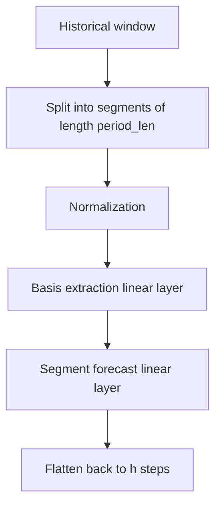
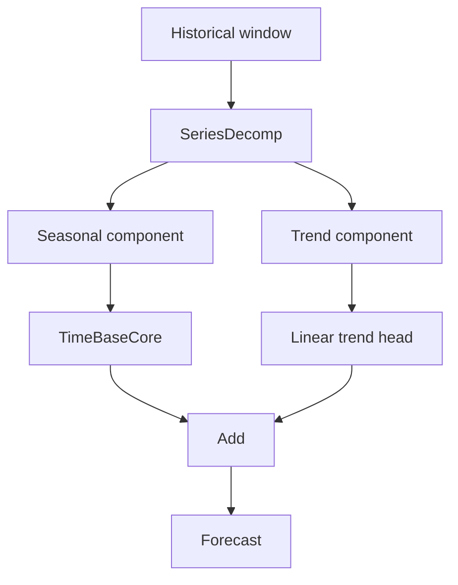

# TimeBaseUla

**TL;DR**
- `timebaseula` provides `TimeBase` and `TimeBaseTrend` for long-horizon forecasting.
- The models plug into **NeuralForecast**.
- This repo also includes evaluation scripts, synthetic data utilities, and tests.
- Start with [installation](install.md), then read [usage](usage.md) and [models](models.md).

<p align="center">
  
</p>

## Why this project exists

TimeBaseUla is a Python adaptation of the **TimeBase** forecasting idea, implemented in a style that fits this repository:

- CPU-first execution
- simple PyTorch modules
- compatibility with Nixtla's `NeuralForecast`
- reproducible tests and scripts
- concise MkDocs documentation

## What you get

| Feature | Notes |
|---|---|
| `TimeBase` | Segment + basis forecasting with two linear layers |
| `TimeBaseTrend` | Adds moving-average trend decomposition |
| `predict_single_series` | Convenience helper for focused inference |
| Synthetic evaluation scripts | Compare TimeBase against DLinear, naive, and MFLES |
| Long-horizon benchmark script | Runs on ECL and Traffic datasets |

## Architecture at a glance



`TimeBaseTrend` adds a decomposition block before the forecast:



## Package surface

```python
from timebaseula import TimeBase, TimeBaseTrend, predict_single_series
```

## How to read the docs

1. [Install the library](install.md)
2. [Follow the usage guide](usage.md)
3. [Review the model notes](models.md)
4. [Explore the scripts](scripts.md)
5. [Check the paper summary and references](references.md)

## Project layout

| Path | Role |
|---|---|
| `timebaseula/models/timebase.py` | model definitions |
| `timebaseula/utils.py` | helper utilities |
| `scripts/` | CLI scripts built with Typer + Rich |
| `tests/` | unit and integration tests |
| `docs/` | MkDocs site |

## Important caveats

- The library is small and focused: it currently exposes the TimeBase family and one helper utility.
- Some development utilities live under `tests/utils/` and are used by scripts for synthetic experiments.
- The docs describe the current repository behavior, not an aspirational future API.
