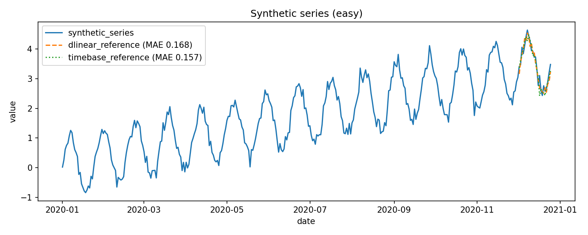
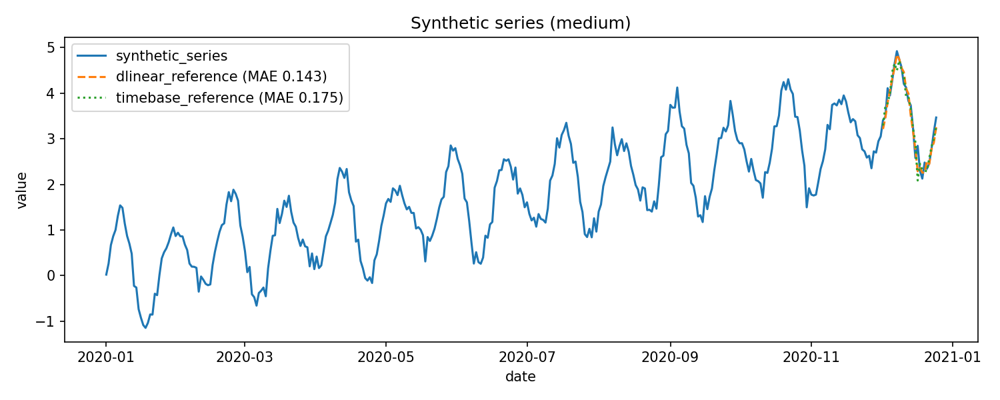
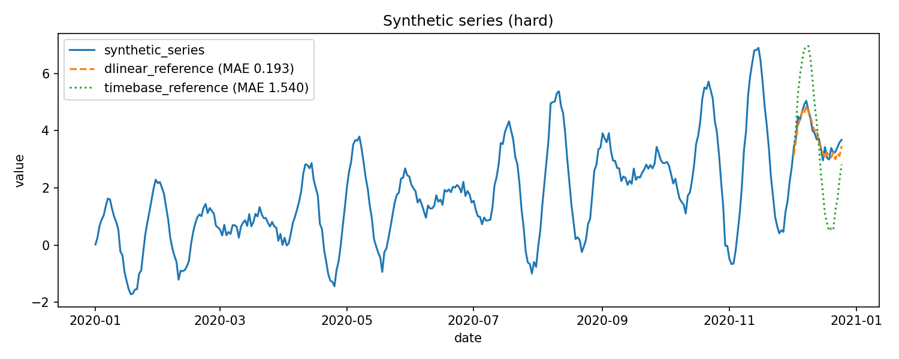

# Usage

## Synthetic series example

The plots below show synthetic series generated with a linear trend, a seasonal component, and consistent noise. The dashed overlay shows the DLinear reference forecast (Nixtla), while the dotted overlay shows TimeBase. The medium and hard variants include progressively stronger amplitude modulation to increase difficulty. These scenarios serve as the standard test cases for future model validation.







### Generator

```python
from tests.utils.synthetic_series import make_synthetic_series

frame_easy = make_synthetic_series(
    length=360,
    noise_std=0.15,
    include_trend=True,
    include_seasonality=True,
    season_period=24,
    amplitude_period=None,
    amplitude_strength=0.0,
)

frame_medium = make_synthetic_series(
    length=360,
    noise_std=0.15,
    include_trend=True,
    include_seasonality=True,
    season_period=24,
    amplitude_period=48,
    amplitude_strength=0.4,
)

frame_hard = make_synthetic_series(
    length=360,
    noise_std=0.15,
    include_trend=True,
    include_seasonality=True,
    season_period=24,
    amplitude_period=96,
    amplitude_strength=0.9,
    amplitude_growth_rate=1.2,
)
```

### Target MAE thresholds

The targets below are derived from running DLinear on the multivariate synthetic cases and adding a 25% margin.

- Easy: **MAE ≤ 0.166** (DLinear 0.1322 × 1.25)
- Medium: **MAE ≤ 0.177** (DLinear 0.1415 × 1.25)
- Hard: **MAE ≤ 0.213** (DLinear 0.1697 × 1.25)
